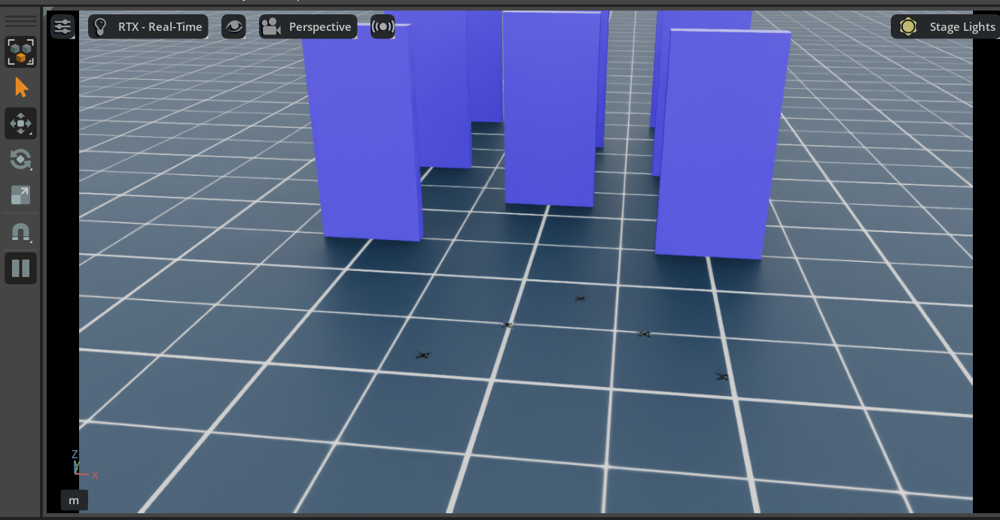

# IsaacLab UAV Swarm Navigation
<p align="center">
  
</p>

## Overview

**Multi-Agent Reinforcement Learning (MARL)** for controlling a **Crazyflie quadrotor swarm** within the **IsaacLab + IsaacSim** GPU-accelerated simulation stack.

The project started as a 5-stage curriculum (hover → point-to-point → obstacles → formation → formation+obstacles) trained with **skrl** (MAPPO/IPPO). Active development has since moved to a **TorchRL**-based pipeline (`source/UavSwarm/UavSwarm/tasks/direct/torchrl_swarm/`) built around **residual RL**: a shared MAPPO policy learns a correction on top of an Artificial Potential Field (APF) baseline controller, rather than the full control command from scratch.

The current research direction studies a **swarm-gravity + Reward Machine** task -- a shared-target task where agents self-organize into a tight, collision-free pack -- and, motivated by a literature review of decentralized collision-avoidance RL, is exploring reward shaping and attention-based neighbor encoders to reduce inter-agent collisions. See [`collision_avoidance_literature.md`](collision_avoidance_literature.md) for the research notes behind that work.

<p align="center">
  
</p>
<p align="center"><em>SwarmGravity (approach) policy composed with a PackingSwarm (settle) policy at evaluation time, switching per agent on containment-sphere entry -- see <code>scripts/torchrl/eval_switching_policy.py</code>.</em></p>

---

## Architecture

### Two pipelines

| Pipeline | Status | Location | Framework |
|----------|--------|----------|-----------|
| **TorchRL swarm-gravity** | Active | `torchrl_swarm/` | TorchRL, shared-weight MAPPO, residual RL + APF |
| skrl baseline/full-task | Original, stable | `baseline_uavswarm/`, `fulltask_swarm_rm/` | skrl, MAPPO/IPPO |

Both share the same Crazyflie asset, PhysX-accelerated `DirectMARLEnv` workflow, and reward-machine concept; the sections below describe the active TorchRL pipeline first.

### Curriculum stages (`torchrl_swarm`)

| Stage | Task | Gym ID | Notes |
|-------|------|--------|-------|
| 1-5 | Legacy 5-stage curriculum (hover / nav / obstacles / formation / formation+obstacles) | `Baseline-TorchRL-UAVSwarm-Direct-v0`, `FullTask-TorchRL-UAVSwarm-Direct-v0` | Ported 1:1 from the original skrl curriculum; `active_stage` in `CurriculumCfg` selects the stage |
| 6 | Formation-assignment scalability | `Formation-TorchRL-UAVSwarm-Direct-v0` | Scatter-spawn -> Hungarian-assigned V-formation slots |
| 7 | Single-goal navigation | `SingleGoal-TorchRL-UAVSwarm-Direct-v0` | Independent per-agent goals, no assignment (isolates whether stage 6's Hungarian machinery matters) |
| 8 | **SwarmGravity** | `SwarmGravity-TorchRL-UAVSwarm-Direct-v0` | Shared target, no fixed formation -- agents self-organize via attraction + inter-agent repulsion. The baseline "approach" task everything below builds on. |
| 9 | SwarmGravityV2 | `SwarmGravityV2-TorchRL-UAVSwarm-Direct-v0` | **Architecture variant of stage 8** -- same task, adds a pairwise-distance-augmented critic state for a permutation-invariant `GraphAttentionCritic` |
| 10 | SwarmGravityRM | `SwarmGravityRM-TorchRL-UAVSwarm-Direct-v0` | 2-state Reward Machine on stage 8: entering the containment sphere assigns a personal packing slot instead of ending the episode |
| 11 | **PackingSwarm** | `PackingSwarm-TorchRL-UAVSwarm-Direct-v0` | The packing half of stage 10, isolated: agents spawn already near the target and settle into Hungarian-assigned slots. Reaches ~95% success where the coupled stage-10 task did not converge. |
| 12 | SwarmGravityAttn | `SwarmGravityAttn-TorchRL-UAVSwarm-Direct-v0` | **Architecture variant of stage 8** -- exposes each agent's K nearest neighbors individually for an attention-based policy (`AttentionMAPPOPolicy`), testing whether Batra/Huang-style neighbor attention reduces collisions |

Stages 9 and 12 never change the *task* -- only the observation/network -- so they can be A/B'd directly against stage 8. Full task-by-task design notes live in the docstrings of `torchrl_swarm_env_cfg.py`'s cfg classes.

### Observation space

Every task's observation is built from the same components (`sensing.py`, `torchrl_swarm_env.py::_build_obs_tensor`); which ones are included depends on the task:

| Component | Dim | Included when |
|-----------|-----|----------------|
| `lin_vel_b`, `ang_vel_b` | 3 + 3 | Always |
| `projected_gravity_b` | 3 | Always |
| `desired_pos_b` | 3 | Always |
| `obstacle_dist`, `obstacle_dir_b` | 1 + 3 | `include_obstacle_in_obs` (sentinel when task has no obstacles) |
| `neighbor_rel_pos_b`, `neighbor_rel_vel_b` | 3 + 3 | Always (nearest neighbor) |
| `mean_neighbor_pos_b`, `mean_neighbor_vel_b` | 3 + 3 | Always (mean-pooled rest of swarm) |
| RM state one-hot | 4 | `include_rm_in_obs` |
| Own RM phase | 1 | `include_swarm_rm_phase_in_obs` (stage 10) |
| K nearest neighbors, individually | K*6 | `include_k_neighbors_in_obs` (stage 12) |

This gives the base 28-dim schema most tasks use (stage 8, 11), with task-specific extensions -- 32-dim (stage 6/full-RM), 24-dim (stage 9, drops the obstacle sentinel), 29-dim (stage 10), 40-dim (stage 12, K=2).

### Controller

Actions are `[vx_b, vy_b, vz_b, yaw_rate]` in `[-1, 1]`, converted to thrust/moment commands by a configurable controller (`controller.py::apply_controller`, `ControllerCfg.type`):
- `geometric` (default) -- cascaded SE(3) geometric controller, globally stable at any attitude.
- `pd_velocity` -- simplified PD velocity tracking, approximate near hover only.
- `direct` -- original raw force/torque mapping.

In **residual RL** mode (`--residual_rl`), the environment receives `baseline_action + residual_scale * policy_action` instead of the raw policy output -- the baseline is a proportional controller toward the target (`point`) or an APF controller with inter-agent repulsion (`apf`, used by the swarm-gravity family of tasks).

---

## Installation

This package is an IsaacLab extension. Requires **Isaac Sim 4.5+** and **Isaac Lab**.

```bash
# Install the extension (from repo root):
cd source/UavSwarm && pip install -e .
```

Dependencies:
- Python >= 3.10
- PyTorch
- skrl >= 1.4.3 (legacy pipeline)
- TorchRL (active pipeline)
- gymnasium

---

## Training

### TorchRL (active pipeline)

```bash
# SwarmGravity (stage 8), residual RL over an APF baseline -- the reference config used
# throughout the swarm-gravity/packing/RM work:
python scripts/torchrl/mappo_train.py \
  --task SwarmGravity-TorchRL-UAVSwarm-Direct-v0 \
  --num_envs 16 --residual_rl --residual_baseline apf \
  --headless

# PackingSwarm (stage 11):
python scripts/torchrl/mappo_train.py \
  --task PackingSwarm-TorchRL-UAVSwarm-Direct-v0 \
  --num_envs 16 --residual_rl --residual_baseline apf \
  --headless

# Attention-based neighbor encoder (stage 12) vs. the plain flat policy, same task:
python scripts/torchrl/mappo_train.py \
  --task SwarmGravityAttn-TorchRL-UAVSwarm-Direct-v0 \
  --num_envs 16 --residual_rl --residual_baseline apf --policy_arch attention \
  --headless

# Permutation-invariant attention critic (stage 9):
python scripts/torchrl/mappo_train.py \
  --task SwarmGravityV2-TorchRL-UAVSwarm-Direct-v0 \
  --num_envs 16 --residual_rl --residual_baseline apf --critic_arch attention \
  --headless
```

`--config scripts/torchrl/torchrl_mappo_cfg_local.yaml` (default, small-GPU-safe) or
`torchrl_mappo_cfg_remote.yaml` (larger `num_envs`, sized for a 16GB+ GPU) select the
hardware profile. `mappo_train.py --help` lists every override (`--collision_penalty`,
`--proximity_neighbors`, `--target_kl`, `--min_safe_distance`, ...).

For long runs on a remote GPU machine over Tailscale/tmux, see `scripts/remote_run.sh`
(`run`/`list`/`log`/`follow`/`attach`/`kill`).

### skrl (legacy pipeline)

```bash
# Baseline environment — MAPPO:
python scripts/skrl/train.py \
  --task=Baseline-UAVSwarm-Direct-v0 \
  --headless --ml_framework torch --algorithm MAPPO

# Full-task environment with shared policy:
python scripts/skrl/train_shared.py \
  --task=FullTask-UAVSwarm-Direct-v0 \
  --headless --ml_framework torch --algorithm MAPPO

# Resume from checkpoint:
python scripts/skrl/train.py \
  --task=Baseline-UAVSwarm-Direct-v0 \
  --headless --checkpoint <path.pt> \
  --ml_framework torch --algorithm MAPPO

# With video recording:
python scripts/skrl/train.py \
  --task=Baseline-UAVSwarm-Direct-v0 \
  --headless --ml_framework torch --algorithm MAPPO \
  --video --video_length 1000 --video_interval 50000 --enable_cameras
```

---

## Evaluation

```bash
# Zero-shot swarm-size generalization eval (Formation-family tasks), with optional video:
python scripts/torchrl/eval_formation_scalability.py \
  --task Formation-TorchRL-UAVSwarm-Direct-v0 --checkpoint <path.pt> \
  --num_agents 8 --video

# Compose a trained SwarmGravity policy with a trained PackingSwarm policy, switching
# per agent on containment-sphere entry (the demo GIF above):
python scripts/torchrl/eval_switching_policy.py \
  --gravity_checkpoint <stage8.pt> --packing_checkpoint <stage11.pt> \
  --num_steps 2500 --video

# skrl: play a trained checkpoint / clone the best individual agent policy
python scripts/skrl/play.py \
  --task=Baseline-UAVSwarm-Direct-v0 \
  --checkpoint <path.pt> --algorithm MAPPO --num_envs 32
python scripts/skrl/eval_policy.py \
  --task=Baseline-UAVSwarm-Direct-v0 \
  --checkpoint <path.pt> --algorithm MAPPO
```

---

## Monitoring

```bash
# TensorBoard (run from IsaacLab root):
./isaaclab.sh -p -m tensorboard.main --logdir=logs
```

---

## Key Configuration

| Parameter | Value | Description |
|-----------|-------|-------------|
| `num_agents` | 5 | Crazyflie drones per environment |
| `decimation` | 2 | Action repeats (effective 50 Hz) |
| `thrust_to_weight` | 1.9 | Thrust scaling |
| `moment_scale` | 0.01 | Moment/torque scaling |

TorchRL policy networks: `[128, 64]` hidden layers (see `scripts/torchrl/torchrl_mappo_cfg_local.yaml`); local profile defaults to 16 parallel envs (small-GPU safe), remote profile scales up. skrl profile (legacy): 256 parallel envs, policy `[128, 128]` / critic `[256, 256, 128]`, target 5M timesteps.

---

## Repository Structure

```
source/UavSwarm/UavSwarm/tasks/direct/
├── torchrl_swarm/            # Active TorchRL pipeline (stages 1-12, see table above)
│   ├── torchrl_swarm_env.py       # BaseSwarmEnv + per-task env subclasses
│   ├── torchrl_swarm_env_cfg.py   # CurriculumCfg + per-task cfg classes
│   ├── curriculum.py               # Per-stage position/spawn setters
│   ├── rewards.py                  # Per-stage reward functions
│   ├── termination.py              # Termination + goal-reached checks
│   ├── sensing.py                  # Nearest/mean/K-nearest neighbor sensing
│   ├── formation.py                # V-formation + electrostatic packing-slot solver
│   ├── controller.py               # geometric / pd_velocity / direct + APF baseline
│   ├── metrics.py                  # Episode metrics
│   ├── debug_viz.py                # Debug markers (goals, containment sphere, ...)
│   └── obstacles.py, rm_state.py
├── baseline_uavswarm/         # skrl baseline env (no RM states)
└── fulltask_swarm_rm/         # skrl full-task env (RM + all 5 stages)

scripts/
├── torchrl/
│   ├── mappo_train.py               # Main TorchRL training entry point
│   ├── mappo_torchl.py              # MAPPO trainer, policy/critic network variants
│   ├── torchrl_wrapper.py           # IsaacLab <-> TorchRL env wrapper
│   ├── eval_formation_scalability.py
│   ├── eval_switching_policy.py     # Composes two checkpoints, switching per agent
│   ├── train_multi_seed.py
│   └── torchrl_mappo_cfg_{local,remote,sanity}.yaml
├── skrl/                     # skrl training / eval scripts (legacy pipeline)
└── remote_run.sh             # Sync + launch long runs on a remote GPU over tmux

collision_avoidance_literature.md   # Research notes behind the current reward-shaping work
```

---

## License

- Isaac Lab components: BSD-3-Clause
- Package: Apache-2.0
